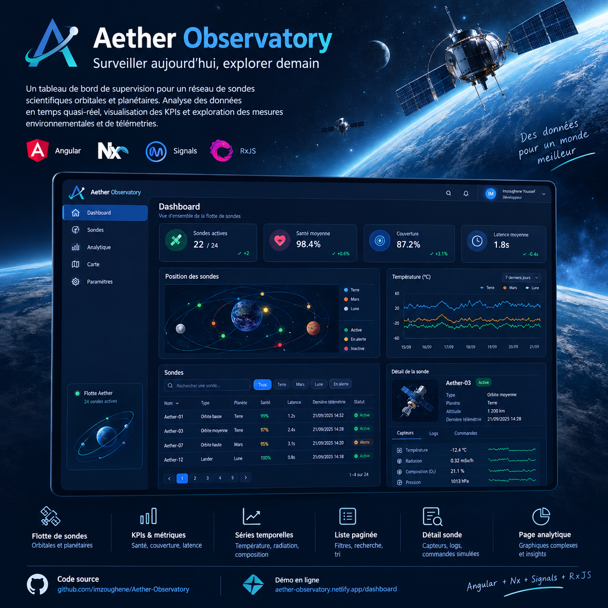

# Aether — Enterprise Dashboard (Angular / Nx)

Aether est un monorepo Nx pour un dashboard d’observabilité d’entreprise. L’application combine Angular standalone, Signals pour l’état local et dérivé, RxJS pour les flux asynchrones, et des bibliothèques Nx séparées par responsabilité.

L’application déployable est `apps/aether-app`. Le backend de démonstration est volontairement remplaçable: le code métier dépend de `ApiClient`, pas de `MockApiAdapter` directement.

## Aperçu UI



L’interface propose un shell responsive, des KPI, des états de probes, des tableaux, des graphiques, des états de chargement et une bascule clair/sombre. Voir [le guide de présentation](./docs/SHOWCASE.md) pour le parcours recommandé.

## Architecture en bref

```text
apps/aether-app
	├── app.config.ts       composition des providers
	├── app.routes.ts       routes lazy et navigation
	└── src/styles.scss     styles globaux

libs/
	├── core/                facades, état UI, auth de démo
	├── data/models/         modèles, pagination, contrat OpenAPI
	├── data/services/       ApiClient, adapter mock, services métier
	├── features/            pages et routes par domaine
	├── ui/shared/            composants, tokens SCSS, thème
	├── ui/charts/            visualisations
	└── ui-layout/            shell, header, sidebar, navigation
```

Flux de dépendances attendu:

```text
app → features → data/services + ui/* + core
										↓
						 data/models (contrats)
```

Les services métier (`ProbesService`, `KpisService`) reçoivent `API_CLIENT`. `provideDataServices()` utilise `MockApiAdapter` par défaut; un adaptateur HTTP peut être injecté au même endroit sans réécrire les features.

## Stack technique

| Domaine            | Technologies                                                                           |
| ------------------ | -------------------------------------------------------------------------------------- |
| Framework          | [Angular](https://angular.dev) 22 (standalone, `OnPush` par défaut via générateurs Nx) |
| Monorepo           | [Nx](https://nx.dev) 23                                                                |
| Réactivité         | Angular Signals, [RxJS](https://rxjs.dev) 7.8                                          |
| Langage            | TypeScript 6 (mode strict)                                                             |
| Styles             | SCSS                                                                                   |
| Tests unitaires    | Jest (`jest-preset-angular`)                                                           |
| Qualité            | ESLint, Prettier                                                                       |
| Build / dev server | `@angular/build` (application builder)                                                 |

## Prérequis

- **Node.js** 20.x ou 22.x (LTS recommandé)
- **npm** 10+ (fourni avec Node)

Vérifier la version :

```sh
node -v
npm -v
```

## Installation reproductible

À la racine du dépôt :

```sh
npm install
```

Pour une installation CI reproductible, utilisez `npm ci` après avoir récupéré `package-lock.json`.

## Développement et vérification

Scripts npm (racine) — préférés pour l’onboarding :

| Commande               | Description                                                   |
| ---------------------- | ------------------------------------------------------------- |
| `npm start`            | Serveur de dev (`aether-app`), rechargement à chaud           |
| `npm run build`        | Build production dans `dist/apps/aether-app`                  |
| `npm test`             | Tests unitaires Jest de `aether-app`                          |
| `npm run e2e`          | Smoke test Playwright du parcours dashboard → probes → détail |
| `npm run lint`         | ESLint sur les projets du workspace                           |
| `npm run lint:fix`     | ESLint avec corrections automatiques                          |
| `npm run format`       | Prettier (écriture)                                           |
| `npm run format:check` | Prettier (vérification CI)                                    |

Équivalents Nx directs :

```sh
npx nx serve aether-app
npx nx build aether-app
npx nx test aether-app
npx nx run-many -t lint
npx nx graph
```

Après `npm run build`, servir le bundle localement :

```sh
npx nx serve-static aether-app
```

Pour préparer Playwright sur une machine CI ou de développement :

```sh
npm run e2e:install
```

Le smoke test démarre automatiquement `aether-app` et vérifie le boot, le dashboard, la liste des probes et l'ouverture du détail de `Public API`.

L’app de dev est en général disponible sur [http://localhost:4200](http://localhost:4200) (port par défaut Angular).

Guide détaillé: [docs/DEVELOPMENT.md](./docs/DEVELOPMENT.md).

## Build et déploiement

Le build de production produit un bundle statique:

```sh
npm run build
npx nx serve-static aether-app
```

Le répertoire à publier est `dist/apps/aether-app/browser`. Il peut être servi par un CDN, Nginx, Azure Static Web Apps, Netlify ou tout autre hébergeur statique. Le serveur doit réécrire les routes applicatives vers `index.html` (fallback SPA), et les fichiers générés avec hash peuvent être mis en cache longuement.

Le projet ne contient pas encore de pipeline ou de backend de production. Pour une livraison, valider au minimum `npm run format:check`, `npm run lint`, `npm test`, `npm run build` et le smoke test E2E.

## Design tokens

Les tokens partagés se trouvent dans [`libs/ui/shared/src/styles/tokens.scss`](./libs/ui/shared/src/styles/tokens.scss), importés par [`apps/aether-app/src/styles.scss`](./apps/aether-app/src/styles.scss). Ils couvrent couleurs, typographie, espacements, rayons, ombres et motion. Le thème sombre est activé avec `data-theme="dark"` sur `<html>` et persiste sous la clé locale `aether-theme`.

Pour ajouter ou modifier une valeur, éditer les deux thèmes dans `tokens.scss` quand la valeur doit être accessible en clair et en sombre, puis vérifier les contrastes et les états `OK`/`WARN`/`CRIT`.

## Remplacer l’API mock

Le contrat est décrit dans [`libs/data/models/api/openapi.yaml`](./libs/data/models/api/openapi.yaml). L’adaptateur par défaut simule la latence et les erreurs dans [`libs/data/services/src/lib/mock-api.adapter.ts`](./libs/data/services/src/lib/mock-api.adapter.ts).

1. Implémenter `ApiClient` avec le transport réel (par exemple `HttpClient`), en conservant les formes de réponse du contrat.
2. Remplacer le provider dans `apps/aether-app/src/app/app.config.ts`:

   ```ts
   import { provideDataServices } from '@aether/data-services';
   import { HttpApiAdapter } from './path/to/http-api.adapter';

   // ...
   ...provideDataServices(HttpApiAdapter),
   ```

3. Conserver `API_ENDPOINTS`, la pagination (`offset`, `limit`) et `ApiClientError` afin que les services et l’UI restent inchangés.
4. Ajouter les tests de l’adaptateur et un test d’intégration de la configuration avant de supprimer le mock.

Pour les détails du contrat et les exemples HTTP, consulter [`libs/data/models/README.md`](./libs/data/models/README.md).

## Structure du dépôt

Vue d’ensemble :

```text
.
├── apps/
│   └── aether-app/          # Application Angular (shell du dashboard)
├── libs/                    # Bibliothèques Nx partagées (feature, UI, data, etc.)
├── docs/
│   └── STRUCTURE.md         # Détail des dossiers et conventions
├── nx.json                  # Configuration Nx (cache, générateurs, plugins)
├── package.json             # Scripts et dépendances workspace
├── tsconfig.base.json       # TypeScript partagé, alias `paths`
├── eslint.config.mjs        # ESLint racine
└── jest.preset.js           # Preset Jest partagé
```

Documentation détaillée : [docs/STRUCTURE.md](./docs/STRUCTURE.md).

## Développement

- **Préfixe composants** : `aether` (configuré dans `nx.json` / `project.json`)
- **Nouvelle lib** : `npx nx g @nx/angular:lib <nom> --directory=libs/<nom>`
- **Nouveau composant** : `npx nx g @nx/angular:component <nom> --project=aether-app`

Voir [CONTRIBUTING.md](./CONTRIBUTING.md) pour le flux de contribution, les conventions et la checklist avant PR.

## Documentation du projet

- [Structure et conventions](./docs/STRUCTURE.md)
- [Développement, tests et déploiement](./docs/DEVELOPMENT.md)
- [Guide de présentation et scénario de démo](./docs/SHOWCASE.md)
- [Contrat des modèles et endpoints](./libs/data/models/README.md)
- [Notes de version](./CHANGELOG.md)

## Licence

MIT — voir le champ `license` dans `package.json`.
